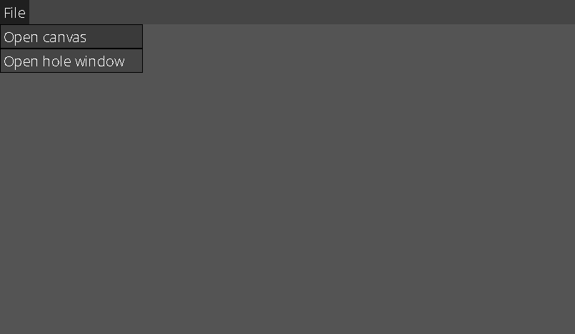
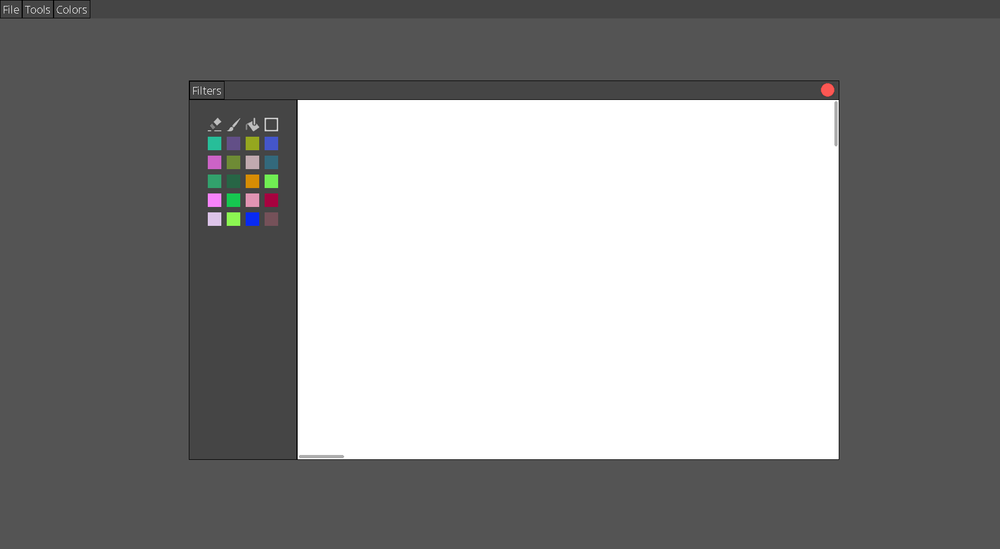

# Overview
This is a graphic user interface library to create your own app and painting app implemented using this library as an example
## GUI
You can create an instance of already implemented widget, such as Icon, MainWindow, DragWidget, BasicButton and more. Or you can create your own class of widget, inheriting it from AbstractWidget, AbstractContainer or Container or any other already implemented widget and overriding and implementing the methods you need
## Painting app
In app go to "File" -> "Open canvas"

You will see a canvas window

Every canvas has a palette with colors and available tools. In the up left corner there's a button "Filters". Also a widget has two scrollbars to navigate within the canvas.

#### Plugins
What if we want to add a new filter or a new tool with no need to recompile the project? To create a tool or a filter you need to write a class with a specific interface and compile it. The program will dynamically link it and get access to provided methods. What kind of interface? Visit my other repo https://github.com/NeginXx/Plugin032
## Compiling and running
```
make init
./make.sh
./out
```